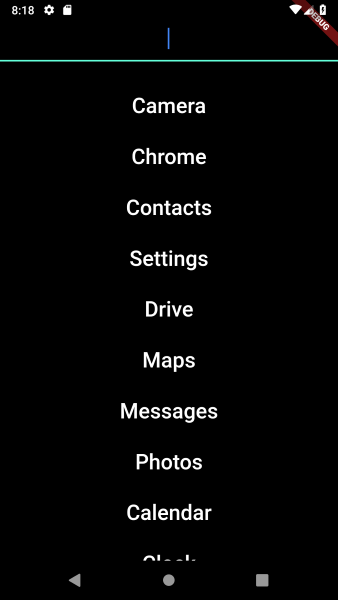

# just_launch

Distraction free launcher

----

Install using [dat-installer](https://github.com/staltz/dat-installer)

[Direct Dat](dat://74cff2fbd54e60cc87f3156ca75ea6112d5df5c8a4e88ab1897bb81d0331134c)
`dat://74cff2fbd54e60cc87f3156ca75ea6112d5df5c8a4e88ab1897bb81d0331134c` or use
[https://just-launch.hashbase.io](https://just-launch.hashbase.io)

## Getting Started

This project is a starting point for a Flutter application.

A few resources to get you started if this is your first Flutter project:

- [Lab: Write your first Flutter app](https://flutter.io/docs/get-started/codelab)
- [Cookbook: Useful Flutter samples](https://flutter.io/docs/cookbook)

For help getting started with Flutter, view our 
[online documentation](https://flutter.io/docs), which offers tutorials, 
samples, guidance on mobile development, and a full API reference.
